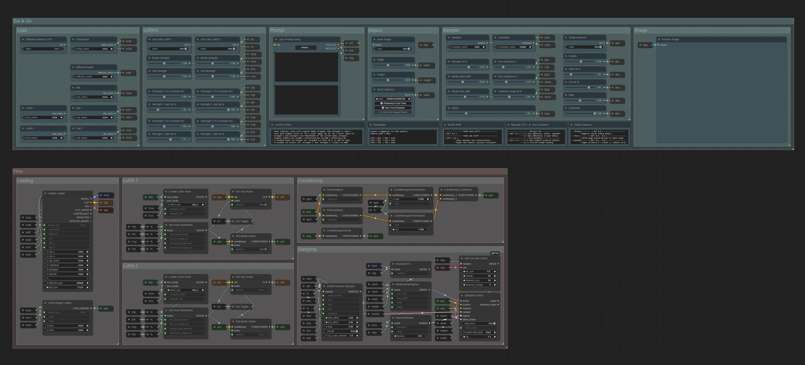
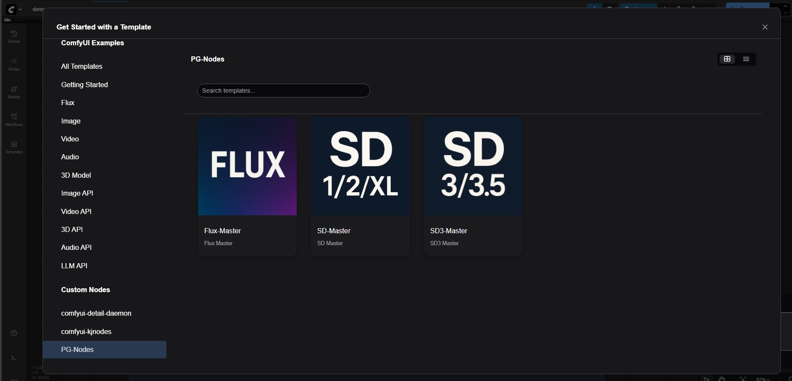
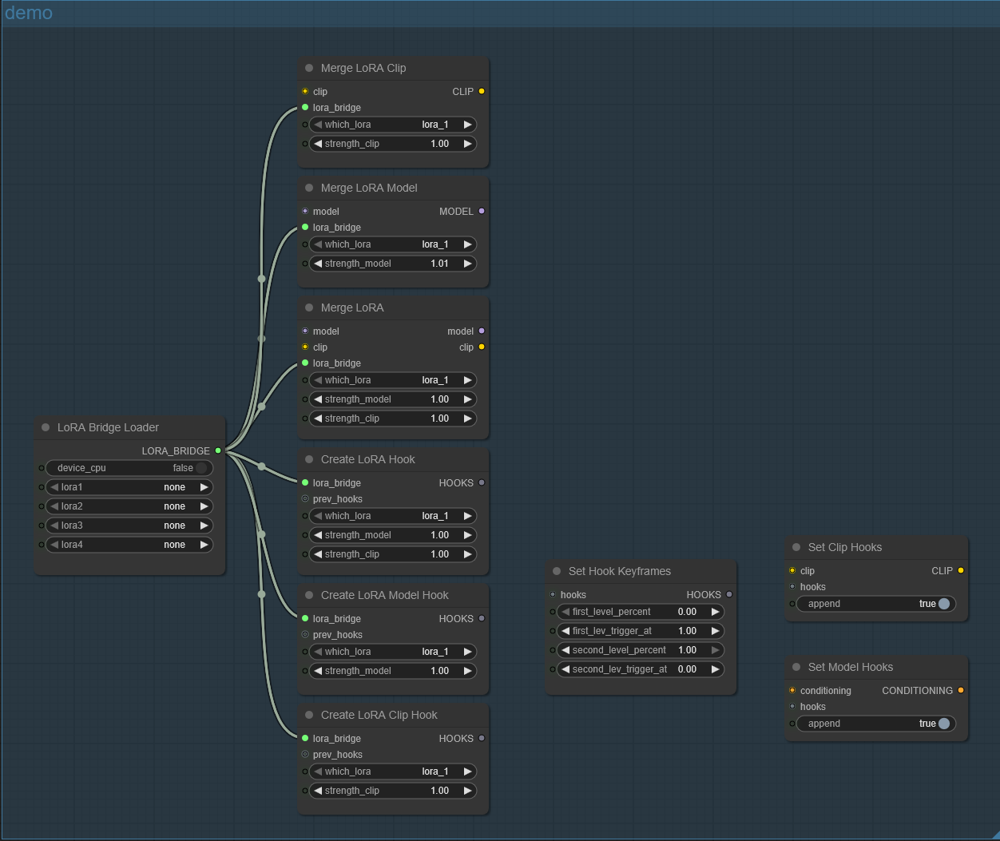
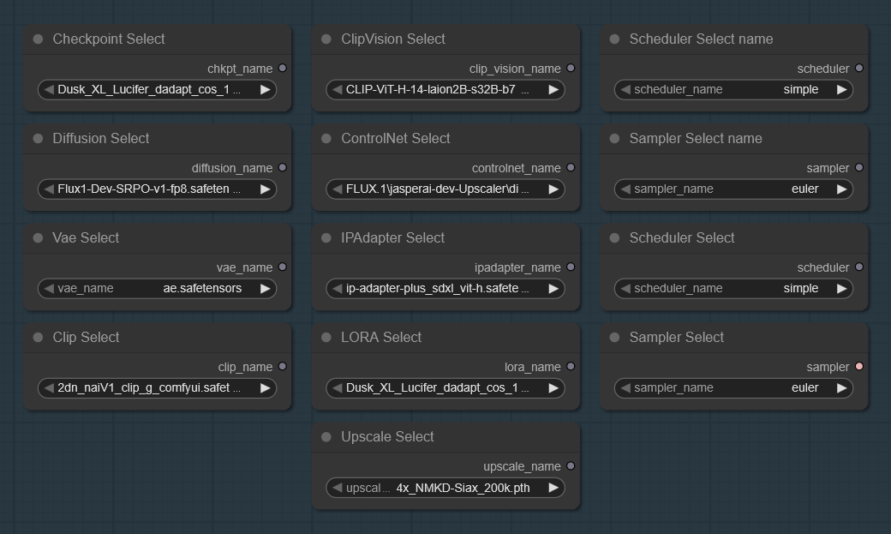
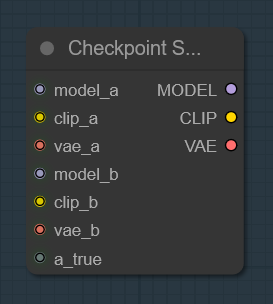
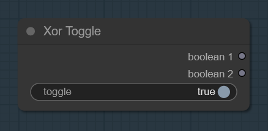
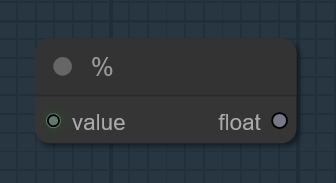

# **PG Nodes**

A suite of ComfyUI nodes focused on fast setup, clean UIs and practical utilities. The repo currently includes:

Demo video of prompt history:

<a href="https://youtu.be/6tFyui_DCDs?si=nSgm8S6JPIJ4ZqNn" target="_blank">
 
</a>

Table of Contents
---
- [**Workflows**](#workflows)
  - [SD-Master, SD3-Master, FLUX-Master](#workflows)
- [**Nodes**](#nodes)
  - [Lazy Prompt](#lazy-prompt)
  - [LoRA, Bridge & Hooks](#lora-bridge-and-hooks)
  - [Unified Loader](#unified-loader)
  - [Swap CFG Guidance](#swap-cfg-guidance)
  - [Select Nodes](#select-nodes)
  - [Just Save Image](#just-save-image)
  - [Checkpoint Switch](#checkpoint-switch)
  - [XOR Toggle](#xor-toggle)
  - [Percent](#percent)
- [*Installation*](#installation)
---

## Workflows

Text-to-Image Workflows, ergonomic, 'ready to use' graphs that let you focus on creating - not hunting scattered knobs.\
Each preset includes the key nodes for its model family, a **Dual-CFG** implementation,
and a custom **LoRA hooks** system for CLIP/UNet paths.

Presets:
* SD-Master
* SD3-Master
* FLUX-Master



* Swap CFG - Switch CFG from value A/B at a chosen point in the run.
* Fast LoRA - Toggle LoRA on the CLIP path (fast) or Conditioning/UNet (classic), while keeping synchronized LoRA strength on both paths.
* Low VRAM friendly - Optionally load models to CPU to free VRAM for sampling.
* Comfort sliders - Safe default ranges; adjust step/min/max via the context menu.
* Mini tips - Small hints for the most important nodes.
* Lazy Prompt - Prompt panel with searchable history of your past prompts.

After installing PG Nodes, the workflows are available under Templates → PG-Nodes.



---

## *Nodes*
  * [Lazy Prompt](#lazy-prompt)
  * [LoRA, Bridge & Hooks](#lora-bridge-and-hooks)
  * [Unified Loader](#unified-loader)
  * [Swap CFG Guidance](#swap-cfg-guidance)
  * [Select Nodes](#select-nodes)
  * [Just Save Image](#just-save-image)
  * [Checkpoint Switch](#checkpoint-switch)
  * [XOR Toggle](#xor-toggle)
  * [Percent](#percent)
* [**Installation**](#installation)

## Lazy Prompt


**Save → Recall → Iterate**
The core idea of **Lazy Prompt** is comfort: write a prompt once, and bring it back instantly next time. The node keeps a compact on‑disk **prompt history** (positive & negative) and lets you quickly **save, search, and re‑use** past prompts like a mini prompt library. Optional add-ons (lens, time of day, lighting, color temperature).

* **Saves every run to history** and lets you **load** any previous entry with a couple of clicks.
* Inline randomizer `{red|green|blue}` for quick variations.
* Optional helpers: camera/lens phrases, time‑of‑day, lighting direction, white balance temperature.

**Details**

* Default history file: `custom_nodes\prompt_history.json`.
* Default cap: `max_entries = 500`.
* **Tip:** right‑click the node (⋯) to open the **context menu** and tweak the history file path or the maximum number of stored entries.

**Lazy Prompt (ext)**

* Starting with version 1.5.0, I added “Lazy Prompt (ext)”, which includes outputs for interoperability with other nodes:


### Lazy Prompt maps
* Default config file: **`PG_Lazy_Prompt_Config.json`**.
* Typical location: inside this repo folder (when installed via Manager/Manual).
* You can change the **config file path** anytime from the node’s **context menu**.
* Maps include examples like:
  * `POS_LIGHT_MAP`, `NEG_LIGHT_MAP` - direction‑dependent phrases.
  * `LENS_CHOICES` - lens list (includes `none`).
  * `TIME_MAP` - time‑of‑day phrases.

### History storage
* Defaults at runtime: `history_path = custom_nodes\prompt_history.json`, `max_entries = 500`.
* You can adjust **history path** and **max entries** from the node’s **context menu**.

---

## LoRA, Bridge & Hooks



0. [Connection Patterns](#Connection-Patterns)
1. [LoRA Bridge Loader](#LoRA-Bridge-Loader)
2. [Merge LoRA Clip](#Merge-LoRA-Clip)
3. [Merge LoRA Model](#Merge-LoRA-Model)
4. [Merge LoRA](#Merge-LoRA)
5. [Create LoRA Clip Hook](#Create-LoRA-Clip-Hook)
6. [Create LoRA Model Hook](#Create-LoRA-Model-Hook)
7. [Create LoRA Hook](#Create-LoRA-Hook)
8. [Set Hook Keyframes](#Set-Hook-Keyframes)
9. [Set Clip Hooks](#Set-Clip-Hooks)
10. [Set Model Hooks](#Set-Model-Hooks)

### Connection Patterns

* “Old-school” (baked-in):\
`LoRA Bridge Loader → Merge LoRA Clip/Model/Both → downstream`\
Weights are merged into CLIP/UNet (destructive bake). Fast at runtime, fixed strength.

* CLIP path (non-destructive):\
`LoRA Bridge Loader → Create LoRA Clip Hook → [optional: Set Hook Keyframes] → Set Clip Hooks`\
Hooks modify the text encoder live; keyframes let you change LoRA strength over time.

* MODEL/Conditioning path (non-destructive):\
`LoRA Bridge Loader → Create LoRA Model Hook → [optional: Set Hook Keyframes] → Set Model Hooks`\
Hooks patch the UNet path; keyframes control the strength timeline.

#### LoRA Bridge Loader 

* Loads up to four LoRA files once and outputs a single LORA_BRIDGE bundle, ready for hook creation or merge nodes.

#### Merge LoRA Clip

* Merges (bakes) the selected LoRA into CLIP. Destructive; no runtime toggling.

#### Merge LoRA Model

* Merges (bakes) the selected LoRA into the MODEL/UNet. Destructive.

#### Merge LoRA

* Bakes the selected LoRA into both MODEL and CLIP in one step.

#### Create LoRA Clip Hook

* Builds a HOOKS group targeting CLIP from the chosen slot in LORA_BRIDGE, with its own strength control.

#### Create LoRA Model Hook

* Builds a HOOKS group targeting the MODEL/UNet path, with independent strength.

#### Create LoRA Hook

* Builds a HOOKS group that targets both CLIP and MODEL simultaneously, exposing separate strengths for each path.

#### Set Hook Keyframes

* Defines a two-point strength curve for a HOOKS group (percent of “model strength”).\
Use to fade in/out or swap strengths at specific progress points.

#### Set Clip Hooks

* Applies a HOOKS group to CLIP (append/merge). Non destructive; respects keyframes.

#### Set Model Hooks

* Applies a HOOKS group to CONDITIONING/MODEL (append/merge). Non destructive; works with keyframed strengths.

---

## Unified Loader


**One loader, more VRAM for sampling**
Unified Loader of Checkpoint, Diffusion UNet, VAE/TAESD, CLIP/CLIP-Vision, ControlNet, IP-Adapter, and Upscale models-**with a simple CPU switch**. Offloading parts of the stack to CPU often **frees up valuable VRAM for the sampler** (KSampler/DiT).

* **Checkpoint** → `CP_MODEL`, `CP_CLIP`, `CP_VAE`
* **Diffusion UNet** (incl. FP8 variants where available)
* **VAE** and **TAESD** shortcuts: `taesd`, `taesdxl`, `taesd3`, `taef1`
* **CLIP** (multi‑file), **CLIP‑Vision**
* **ControlNet**, **IP‑Adapter**, **Upscale models**

> Tip: The CPU switch is **best‑effort**. Depending on your setup and model family, not everything can be moved off-GPU, but when it works, the sampler gets more VRAM.

---

## Swap CFG Guidance


Set two CFG values and switch between them at a chosen progress (%). Early steps use CFG 1, then at the trigger point, sampling continues with CFG 2.
Great for front-loading structure (higher CFG) and then relaxing detail (lower CFG),or the opposite.\
Parameters: cfg1, cfg2, and swap_percent (0–100%).

---

## Select Nodes



A compact suite of selectors for different model families. In the `UniLoader/` subfolder you’ll also find variants compatible with the Unified Loader.\
Available selectors: MODEL, CLIP, VAE, CLIP_VISION, CONTROL_NET,
IPADAPTER, UPSCALE_MODEL, Sampler, and Scheduler.

---

## Just Save Image


**Nodes**
Minimal nodes that **save** images in an `IMAGE` batch to ComfyUI’s output directory when a boolean toggle is ON. Saves without preview.

* **Just Save Image** - output node (no outputs).
* **Just Save Image & Out** - passthrough version that returns the input `IMAGE`.

---

## Checkpoint Switch



A simple boolean controlled switch, between two (MODEL/CLIP/VAE) triplets.\
Flip the input to route either set A or set B downstream.

---

## XOR Toggle



A boolean switch, that flips two outputs in opposition.\
When toggle = TRUE → Boolean 1 = TRUE, Boolean 2 = FALSE.\
When toggle = FALSE → Boolean 1 = FALSE, Boolean 2 = TRUE.

---

## Percent



Converts an INT input to a FLOAT by dividing by 100.

---

## Installation


**Via ComfyUI Manager**

> 1. Open **ComfyUI Manager**.
> 2. Search for **“PG Nodes”**.
> 3. Install and restart ComfyUI.

**Manual**

> 1. Go to the repo **Code → Download ZIP**.
> 2. Extract the ZIP.
> 3. Rename the extracted folder to **`PG-nodes`**.
> 4. Move that folder to your ComfyUI custom nodes directory:
>    * Windows (typical): `C:\Users\<you>\Documents\ComfyUI\custom_nodes\PG-nodes`
>    * Or wherever your `ComfyUI` root lives → `custom_nodes/PG-nodes`
> 5. Restart ComfyUI.
> 6. In the node search, look for the **PG** category (e.g., *Lazy Prompt*, *Unified Loader*).

---

## Versioning & Updates

```
[2.0.0]
 Added
- Workflows: SD-Master, SD3-Master, Flux-Master
- LoRA Hooks bundle: compact toolkit for LoRA on MODEL/CLIP
- Select Nodes: set of selector helper nodes used to pick model file names
- Checkpoint Switch: two‑way switch for (MODEL, CLIP, VAE) triplets.
- Swap CFG Guidance: two‑phase CFG guider (CFG1 → early, CFG2 → late).
- Percent: INT 0..100 → FLOAT 0..1 helper.
- XOR Toggle:
- Checkpoint Switch:

[1.5.5]
 Fix
- Unified Loader, DIFFUSION_MODEL output fix and Class name.

[1.5.0]
 Added
- Lazy Prompt (ext).

[1.0.0]
 Added
- Initial public release.
- Nodes: Lazy Prompt (+mini), Unified Loader (+mini), Just Save Image (+Out).
- Prompt history JSON + config file `PG_Lazy_Prompt_Config.json`.
```
