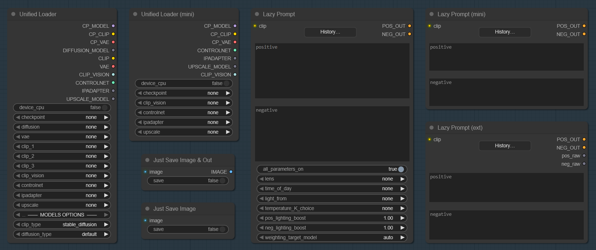
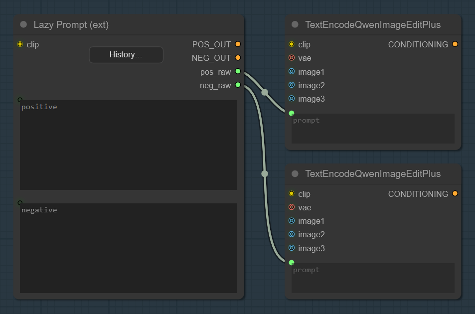
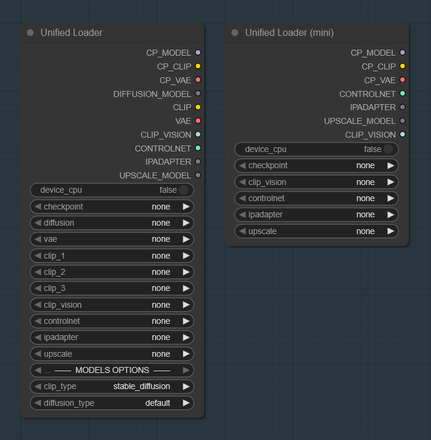
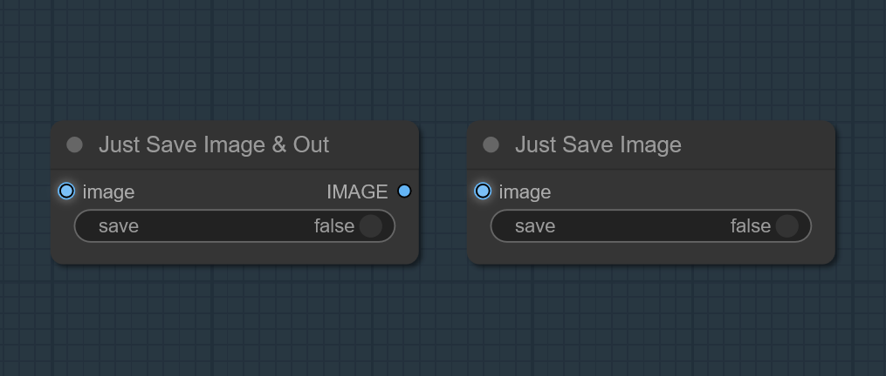
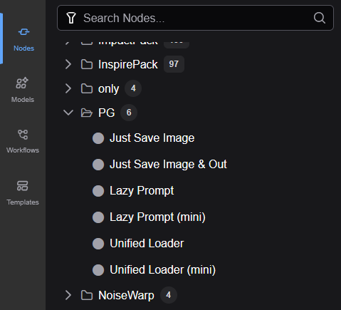

# PG Nodes

A small suite of pragmatic ComfyUI nodes focused on fast setup, clean UIs, and practical workflow utilities. The repo currently includes:

* **Lazy Prompt** - a lightweight prompt history, inline randomizer `{red|green|blue}`, optional lens/time/lighting/temperature augmentations.
* **Unified Loader** - one loader to rule them all (Checkpoint, Diffusion UNet, VAE/TAESD, CLIP, CLIP‑Vision, ControlNet, IP‑Adapter, Upscale), with CPU offload. Includes a compact **mini** variant.
* **Just Save Image** - minimal output/passthrough nodes that save images conditionally, without UI previews.

Demo video of prompt history:
<a href="https://youtu.be/6tFyui_DCDs?si=nSgm8S6JPIJ4ZqNn" target="_blank">
 
</a>

---

## Table of Contents

* [Lazy Prompt](#lazy-prompt)
* [Unified Loader](#unified-loader)
* [Just Save Image](#just-save-image)
* [Installation](#installation)
* [Configuration](#configuration)

---

## Lazy Prompt


**Save → Recall → Iterate**
The core idea of **Lazy Prompt** is comfort: write a prompt once, and bring it back instantly next time. The node keeps a compact on‑disk **prompt history** (positive & negative) and lets you quickly **save, search, and re‑use** past prompts like a mini prompt library. Optional add-ons (lens, time of day, lighting, color temperature).

**Node**

* **Saves every run to history** and lets you **load** any previous entry with a couple of clicks.
* Inline randomizer `{red|green|blue}` for quick variations.
* Optional helpers: camera/lens phrases, time‑of‑day, lighting direction, white balance temperature.

**Details**

* Default history file: `custom_nodes\prompt_history.json`.
* Default cap: `max_entries = 500`.
* **Tip:** right‑click the node (⋯) to open the **context menu** and tweak the history file path or the maximum number of stored entries.

**Lazy Prompt (ext)**

* Starting with version 1.5.0, I added “Lazy Prompt (ext)”, which includes outputs for interoperability with other nodes:



---

## Unified Loader



**One loader, more VRAM for sampling**
Unified Loader of Checkpoint, Diffusion UNet, VAE/TAESD, CLIP/CLIP-Vision, ControlNet, IP-Adapter, and Upscale models-**with a simple CPU switch**. Offloading parts of the stack to CPU often **frees up valuable VRAM for the sampler** (KSampler/DiT).

**Can load**

* **Checkpoint** → `CP_MODEL`, `CP_CLIP`, `CP_VAE`
* **Diffusion UNet** (incl. FP8 variants where available)
* **VAE** and **TAESD** shortcuts: `taesd`, `taesdxl`, `taesd3`, `taef1`
* **CLIP** (multi‑file), **CLIP‑Vision**
* **ControlNet**, **IP‑Adapter**, **Upscale models**

> Tip: The CPU switch is **best‑effort**. Depending on your setup and model family, not everything can be moved off-GPU, but when it works, the sampler gets more VRAM.

---

## Just Save Image



**Nodes**
Minimal nodes that **save** images in an `IMAGE` batch to ComfyUI’s output directory when a boolean toggle is ON. Saves without preview.

* **Just Save Image** - output node (no outputs).
* **Just Save Image & Out** - passthrough version that returns the input `IMAGE`.

**Details**

* Filenames: `<prefix>_<counter>_.png` where `<counter>` auto-increments from the highest existing number in the output folder. Default prefix: `ComfyUI`.
* Metadata: stores `prompt`, `workflow`, `parameters`, and `filename_prefix` as PNG text chunks when provided via the hidden `prompt`/`extra_pnginfo` inputs.

---

## Installation



**Via ComfyUI Manager**

> 1. Open **ComfyUI Manager**.
> 2. Search for **“PG Nodes”**.
> 3. Install and restart ComfyUI.

**Manual**

> 1. Go to the repo **Code → Download ZIP**.
> 2. Extract the ZIP.
> 3. Rename the extracted folder to **`PG-nodes`**.
> 4. Move that folder to your ComfyUI custom nodes directory:
>    * Windows (typical): `C:\Users\<you>\Documents\ComfyUI\custom_nodes\PG-nodes`
>    * Or wherever your `ComfyUI` root lives → `custom_nodes/PG-nodes`
> 5. Restart ComfyUI.
> 6. In the node search, look for the **PG** category (e.g., *Lazy Prompt*, *Unified Loader*).

---

## Configuration

### Lazy Prompt maps

* Default config file: **`PG_Lazy_Prompt_Config.json`**.
* Typical location: inside this repo folder (when installed via Manager/Manual).
* You can change the **config file path** anytime from the node’s **context menu**.
* Maps include examples like:

  * `POS_LIGHT_MAP`, `NEG_LIGHT_MAP` - direction‑dependent phrases.
  * `LENS_CHOICES` - lens list (includes `none`).
  * `TIME_MAP` - time‑of‑day phrases.

### History storage

* Defaults at runtime: `history_path = custom_nodes\prompt_history.json`, `max_entries = 500`.
* You can adjust **history path** and **max entries** from the node’s **context menu**.


## Versioning & Updates

```
[1.0.0]
 Added
- Initial public release.
- Nodes: Lazy Prompt (+mini), Unified Loader (+mini), Just Save Image (+Out).
- Prompt history JSON + config file `PG_Lazy_Prompt_Config.json`.

[1.5.0]
 Added
- Lazy Prompt (ext).

[1.5.5]
 Fix
- Unified Loader, DIFFUSION_MODEL output fix and Class name.
```
